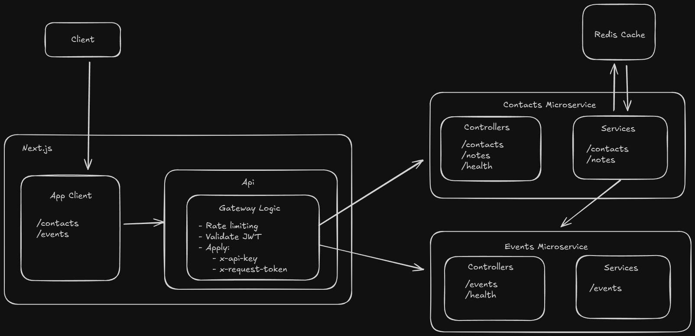

# Mini-CRM Project Overview

This project explores a gateway-based full-stack architecture using Next.js as the front end and API gateway, paired with independent NestJS services following a microservice-style architecture.

The focus was not just building features, but to intentionally experiment with real-world technologies, architectural patterns, and production tradeoffs commonly found in modern web systems.

## Architecture Overview

## Tech Stack

### Frontend / Gateway

- Next.js (frontend and gateway)
- Supabase Auth
- TanStack Query
- Tailwind + CSS-in-JS styled components (experimented with both)

### Backend Services

- NestJS
- Prisma
- Supabase PostgreSQL
- Redis (server side caching)
- REST-based inter-service communication (event-style interactions)

### Infrastructure and Tooling

- Docker and Docker compose
- Github Actions (automated integration tests)
- Health check endpoints for observability
- Shared internal npm packages between microservices for common utilites and types

## High-Level Architecture

### Next.js as API Gateway

- Authentication boundary
- Request shaping and validation
- Constructing authenticated requests to backend microservices
- Rate limiting (token bucket algorithm)
- Request forwarding to backend microservices

Keeps frontend concerns centralized while preventing direct client access to backend services.

### NestJS Backend Services

Backend services follow a microservice-style architecture:

- Each service owns its business logic and data
- Data access handled via Prisma to Supabase
- Service-specific dependencies, environments and configuration
- Explicit service-to-service REST communication
- Shared internal npm packages consumed via local builds within the monorepo

## Key Design Decisions

### Authentication and Authorization Flow

- Users authenticate via Supabase, receiving a JWT
- The JWT is validated at both:
  - The gateway layer (authentication + userid used in rate limiting)
  - The backend layer (improved security)
- The gateway forwards requests to backend services using:
  - The user's JWT
  - A dedicated internal API key

This ensures backend services:

- Are never directly exposed to the client
- Remain protected even if backend URLs are accessed directly

### Monorepo Strategy

Experimented with both an **isolated monorepo** and a **hoisted monorepo**. Decided on an isolated monorepo because:

- Simplify Docker builds per service
- Prisma client isolation per service
- Allows services to evolve independently without dependency bleeding
- Keep shared code in explicit internal packages to avoid code duplication across services

### Inter-Service Communication

- Explicit REST communication between services
- Certain events (creating, updating, deleting) follow an event-style pattern facilitating communication between the contacts service and the events service
- No message broker was introducted to avoid premature complexity

##### Reflection:

The interceptor-based event pattern used is too decoupled from core business logic and introduces maintainability issues and overhead with parsing the request itself in the interceptor. A true event-driven architecture using a third-party message broker would have been a more robust solution.

### Rate Limiting and Caching

- Frontend caching handled with TanStack Query
- Redis used for server side caching only
- Rate limiting implemented in the gateway using token bucket algorithm and TTL based cleanup

### Reliability and Observability

- Health check endpoints per service
- Frontend status checks to reflect backend availability
- Backend logging middleware
- Integration tests automated via GitHub Actions

### Deployment and Hosting

- Next.js frontend and API gateway deployed on Vercel
- NestJS backend services deployed on Render using Dockerfiles
- Services deployed independently with environment-specific configuration

## Key Learnings

A lot of these tools were either brand new to me, or ones I had only previously used at a surface level while implementing them in projects or work. As such I was able to learn a lot from this project by actually taking the time to read into, and think about the tools I use and why. Some of the key things I learned were:

- Next.js is not a 'universal backend solution' as I thought it was before this project. It has clear pros and cons. While it may be good for SEO dependent solutions, it has poor backend and middleware patterns compared to dedicated backend frameworks, and can cause lots of overheard issues with interactive, client-based apps.
- Caching, whether with Tanstack query, Redis, or any other way, has a significant impant on performance and UX responsiveness.
- Event-driven systems require proper infrastucture (queues, brokers, etc.) to be effective.
- Rate limit strategies and their tradeoffs, such as token bucket vs sliding window algorithms
- How internal npm packages work
- Docker build contexts and service isolation
